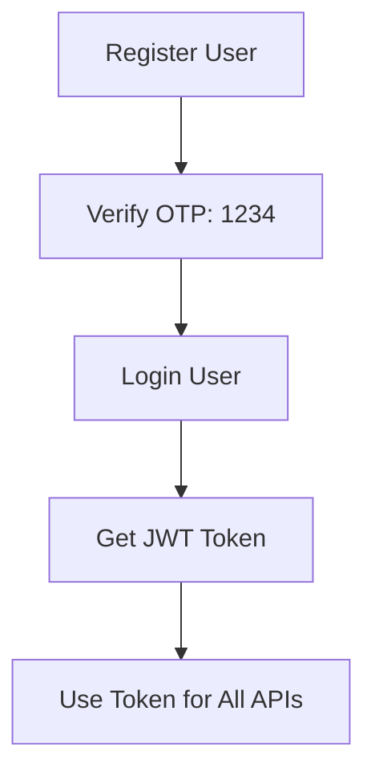

# 🚀 Velaa API Endpoints Reference

## 📋 **Quick Reference**

**Base URL**: `http://localhost:3000/api`  
**Authentication**: Bearer Token (JWT)  
**Default OTP**: `1234` (Development Mode)

---

## 🔐 **Authentication Endpoints (17 APIs)**

### **📝 Public Routes (No Auth Required)**
| Method | Endpoint | Description |
|--------|----------|-------------|
| `POST` | `/auth/register` | Register new user |
| `POST` | `/auth/verify-otp` | Verify OTP (use: 1234) |
| `POST` | `/auth/login` | User login |
| `POST` | `/auth/forgot-password` | Initiate password recovery |
| `POST` | `/auth/verify-recovery-otp` | Verify recovery OTP |
| `POST` | `/auth/reset-password` | Reset password |

### **👤 Profile Management (Auth Required)**
| Method | Endpoint | Description |
|--------|----------|-------------|
| `GET` | `/auth/profile` | Get user profile |
| `PUT` | `/auth/profile` | Update profile |
| `PUT` | `/auth/change-password` | Change password |
| `POST` | `/auth/send-phone-verification` | Send phone OTP |
| `POST` | `/auth/verify-phone` | Verify phone number |
| `POST` | `/auth/logout` | Logout user |

### **👨‍💼 Admin Management (Admin Only)**
| Method | Endpoint | Description |
|--------|----------|-------------|
| `GET` | `/auth/users` | Get all users |
| `GET` | `/auth/users/:id` | Get user by ID |
| `PUT` | `/auth/users/:id` | Update user |
| `DELETE` | `/auth/users/:id` | Delete user |
| `GET` | `/auth/stats` | User statistics |

---

## 🚗 **Vehicle Management Endpoints (16 APIs)**

### **📋 Vehicle CRUD**
| Method | Endpoint | Description |
|--------|----------|-------------|
| `GET` | `/vehicles` | Get all vehicles |
| `POST` | `/vehicles` | Create vehicle |
| `GET` | `/vehicles/:id` | Get vehicle by ID |
| `PUT` | `/vehicles/:id` | Update vehicle |
| `DELETE` | `/vehicles/:id` | Delete vehicle |

### **🔍 Search & Filter**
| Method | Endpoint | Description |
|--------|----------|-------------|
| `GET` | `/vehicles/search` | Advanced search |

### **📊 Status Management**
| Method | Endpoint | Description |
|--------|----------|-------------|
| `PUT` | `/vehicles/:id/status` | Update status |

### **📁 File Management**
| Method | Endpoint | Description |
|--------|----------|-------------|
| `POST` | `/vehicles/:id/images` | Upload images |
| `POST` | `/vehicles/:id/documents` | Upload documents |
| `DELETE` | `/vehicles/:id/images/:imageId` | Delete image |
| `DELETE` | `/vehicles/:id/documents/:docId` | Delete document |

### **🔧 Maintenance & Defects**
| Method | Endpoint | Description |
|--------|----------|-------------|
| `GET` | `/vehicles/:id/maintenance` | Get maintenance |
| `POST` | `/vehicles/:id/maintenance` | Add maintenance |
| `GET` | `/vehicles/:id/defects` | Get defects |
| `POST` | `/vehicles/:id/defects` | Add defect |

### **📈 Analytics**
| Method | Endpoint | Description |
|--------|----------|-------------|
| `GET` | `/vehicles/stats` | Vehicle statistics |

---

## 🏥 **System Endpoints**

| Method | Endpoint | Description |
|--------|----------|-------------|
| `GET` | `/health` | API health check |
| `GET` | `/docs` | API documentation |

---

## 🔑 **Authentication Flow**

---

## 📊 **Status Codes**

| Code | Status | Description |
|------|--------|-------------|
| `200` | OK | Success |
| `201` | Created | Resource created |
| `400` | Bad Request | Validation error |
| `401` | Unauthorized | Authentication required |
| `403` | Forbidden | Insufficient permissions |
| `404` | Not Found | Resource not found |
| `409` | Conflict | Resource already exists |
| `500` | Server Error | Internal server error |

---

## 🎯 **Testing Order**

### **1. Authentication Setup**
1. Register User → Verify OTP → Login → Get Token

### **2. Vehicle Operations**
1. Create Vehicle → Get Vehicles → Update → Delete

### **3. Advanced Features**
1. Search → Status Update → File Upload → Maintenance

---

**Total APIs**: 33 endpoints  
**Modules**: Authentication (17) + Vehicle Management (16)  
**Ready for Production**: ✅
